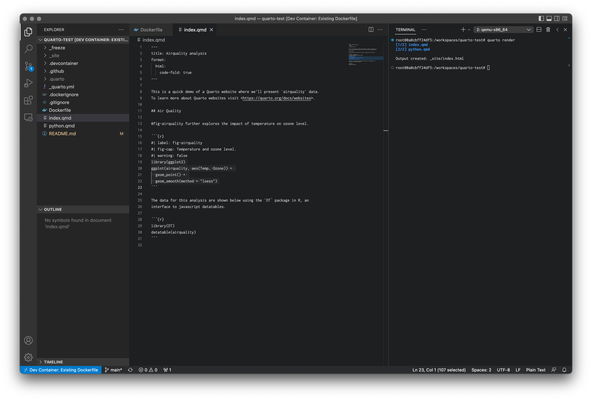

# quarto-test

Testing quarto for reporting with R / python. The intention here is to explore an option for
delivering rapid ad hoc analyses via the web in a reproduible and simple way.

This repo demonstrates:
* using [Docker](https://www.docker.com/) to build a reproducible environment for analysis in  
  either R or python. 
* [devcontainers](https://code.visualstudio.com/docs/devcontainers/containers) to run analyses
  within a containerised environment
* using [quarto](https://quarto.org/) for literate programming and reporting
* using [github-pages](https://pages.github.com/) for hosting of built report
* using [github workflows](https://docs.github.com/en/actions/using-workflows) to automatically
  publish via CI/CD.

The intention is to work towards a self contained reproducible template for performing and 
reporting ad hoc analyses.

Analyses are performed within a docker container (with R / jupyter installed), and output
is stored in `_freeze`. The site can then be publish easily, either outside of the container
locally (with `quarto publish gh-pages`) or automatically via the CI pipeline in 
`.github/workflows`.

More sophisticated hosting could be explored if e.g. database backends are required to display information.

## Running

* Clone the repo locally
* From vs-code, ensure you have installed Docker extensions
* From command pallette run "Docker: build image
* From command pallette run "Dev Containers: Open Folder in Containter" to connect to container for 
  running analysis. On a Mac, any files you create will be owned by your user (not root).
* Run `quarto render` to build the site.
* Run `quarto preview` to build the site (broken for docker/M1 mac I think).
* Run `quarto publish gh-pages` to publish to github pages (you need to run once locally).

## Links:

* https://www.r-bloggers.com/2022/07/how-to-set-up-quarto-with-docker-part-1-static-content/
* https://code.visualstudio.com/docs/containers/overview
* https://code.visualstudio.com/docs/devcontainers/create-dev-container
* https://code.visualstudio.com/docs/devcontainers/containers
* https://github.com/quarto-dev/quarto-actions/tree/main/publish
